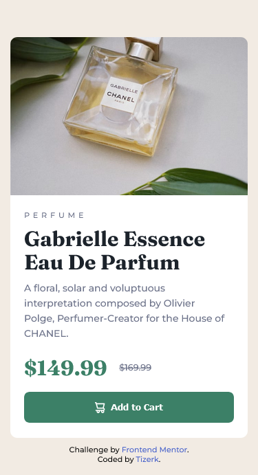
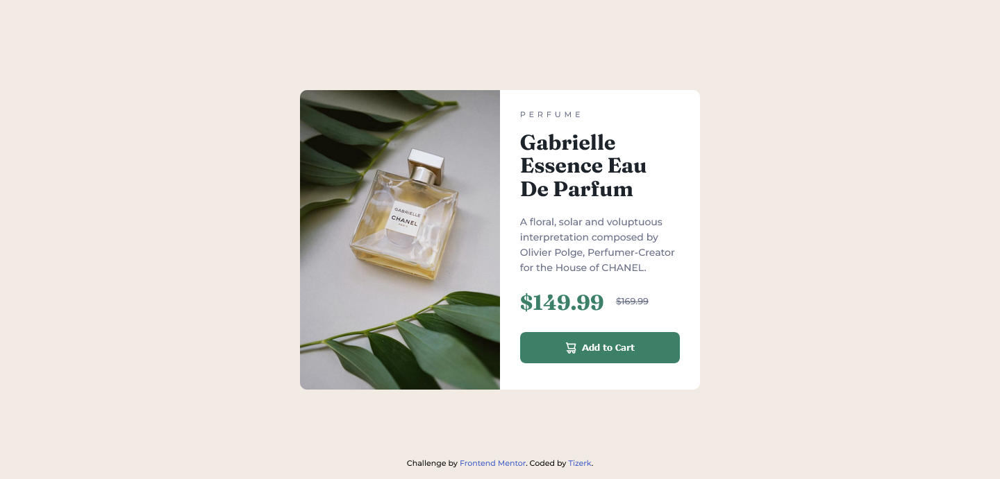

# Frontend Mentor - Product preview card component solution

This is a solution to the [Product preview card component challenge on Frontend Mentor](https://www.frontendmentor.io/challenges/product-preview-card-component-GO7UmttRfa). Frontend Mentor challenges help you improve your coding skills by building realistic projects.

## Table of contents

- [Overview](#overview)
  - [The Challenge](#the-Challenge)
  - [Screenshots](#screenshots)
  - [Links](#links)
- [My process](#my-process)
  - [Built with](#built-with)
  - [What I learned](#what-i-learned)
  - [Useful resources](#useful-resources)
- [Author](#author)

## Overview

### The Challenge

Users should be able to:

- View the optimal layout depending on their device's screen size
- See hover and focus states for interactive elements

### Screenshots





### Links

- Solution URL: [https://github.com/tizerk/frontendmentor-product-preview-card-component](https://github.com/tizerk/frontendmentor-product-preview-card-component)
- Live Site URL: [https://tizerk.github.io/frontendmentor-product-preview-card-component/](https://tizerk.github.io/frontendmentor-product-preview-card-component/)

## My process

### Built with

- CSS custom properties
- Flexbox
- CSS Grid
- Mobile-first workflow

### What I learned

Custom CSS Properties

```css
:root {
  --dark-cyan: hsl(158, 36%, 37%);
  --very-dark-cyan: hsl(156, 59%, 25%);
  --cream: hsl(30, 38%, 92%);
  --very-dark-blue: hsl(212, 21%, 14%);
  --dark-grayish-blue: hsl(228, 12%, 48%);
  --white: hsl(0, 0%, 100%);
}
```

Hiding Images for Certain Display Sizes

```css
.product-image-desktop {
  display: none;
}

@media screen and (min-width: 1440px) {
  .product-image-desktop {
    display: block;
    border-radius: 10px 0px 0px 10px;
    width: 100%;
    height: 100%;
  }
}
```

### Useful resources

- [W3 Docs](https://www.w3docs.com/snippets/css/how-to-hide-elements-in-a-responsive-layout.html) - Helped me hide an image for certain display sizes in a responsive layout.

## Author

- Frontend Mentor - [@tizerk](https://www.frontendmentor.io/profile/tizerk)
